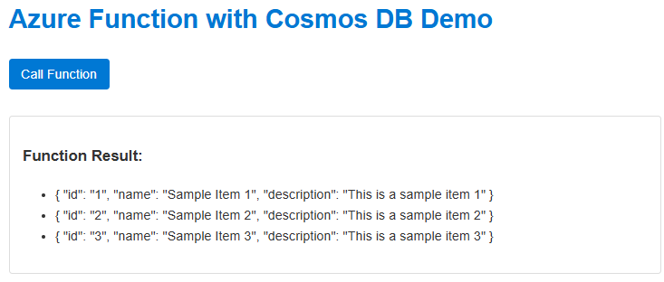

# Azure Functions with JavaScript Frontend and Cosmos DB Emulator

A full-stack web application with a JavaScript frontend and .NET Azure Function backend, optimized for development in VS Code with Dev Containers. This setup now includes the Azure Cosmos DB Emulator running in a Docker container managed by Docker Compose.



## Dev Container Quick Start (Recommended)

1.  Prerequisites:
    *   [VS Code](https://code.visualstudio.com/)
    *   [Dev Containers extension](https://marketplace.visualstudio.com/items?itemName=ms-vscode-remote.remote-containers)
    *   [Docker Desktop](https://www.docker.com/products/docker-desktop/) (Ensure it's running and configured to use Linux containers if you are on Windows)

2.  Open in VS Code with Dev Container:
    *   Clone this repository.
    *   Open the cloned folder in VS Code.
    *   When prompted, click "Reopen in Container".
    *   🔄 Wait for the Dev Container to build and start. This will also pull and start the Azure Cosmos DB Emulator container.

3.  **Cosmos DB Emulator Setup & Verification**:
    *   The `postCreateCommand` in `.devcontainer/devcontainer.json` automatically runs the `backend/Scripts/SetupCosmosDb.cs` script.
    *   This script checks if the Cosmos DB Emulator is running at `https://cosmosdb:8081/`.
    *   If the emulator is accessible, the script creates the `MyDatabase` database and `MyContainer` container, and seeds it with sample data.
    *   You can verify the emulator is running and explore the data by opening `https://localhost:8081/_explorer/index.html` in your web browser. You may need to accept a self-signed certificate warning.
    *   The `backend/local.settings.json` is pre-configured to connect to this emulator instance (`"UseMockData": "false"`).

4.  **Build the Backend**:
    *   Once the container is running and the `postCreateCommand` has finished, you can build the backend.
    *   Press `Ctrl+Shift+B` (or `Cmd+Shift+B` on macOS) to run the default build task. This compiles the Azure Functions project.

5.  **Start the Azure Function (Backend) with Debugging**:
    *   ▶️ Press `F5` or go to "Run and Debug" (Ctrl+Shift+D) and select the "Debug Azure Functions (.NET Isolated)" configuration, then click the green play button.
    *   This launches the Azure Function app with full debugging capabilities. The terminal output will show the Functions host starting up and the available HTTP endpoints (usually on port 7071 inside the container, which is forwarded to 7071 on your host).

6.  **Launch the Frontend Web Client**:
    *   In the VS Code Explorer, right-click the `index.html` file in the root of the project.
    *   Select "Open with Live Server".
    *   🌐 Your default web browser will open the frontend application, typically at `http://localhost:5500`.
    *   The frontend JavaScript (`app.js`) is configured to call the Azure Function running on port 7071.

## Dev Container Debugging Experience

The Dev Container is pre-configured for an optimal debugging experience:

1.  Set breakpoints in your C# Azure Function code (e.g., in `backend/Functions/MyFunction.cs`).
2.  Start the Azure Function using `F5` as described above.
3.  Interact with the frontend application (e.g., click the "Get Data" button) to trigger requests to your Azure Function. Your breakpoints in the C# code should be hit.
4.  For frontend debugging (JavaScript in `app.js`), use your browser's Developer Tools (usually by pressing F12).

## Key Project Files

*   `backend/Functions/MyFunction.cs`: Main Azure Function implementation.
*   `app.js`: Frontend JavaScript that calls the Azure Function.
*   `.devcontainer/devcontainer.json`: Main configuration for the Dev Container, specifying the Docker Compose file and post-creation setup.
*   `.devcontainer/docker-compose.yml`: Defines the `app` service (your development environment) and the `cosmosdb` service (Azure Cosmos DB Emulator).
*   `.devcontainer/Dockerfile`: Defines the Docker image for the `app` service.
*   `backend/Scripts/SetupCosmosDb.cs`: Script to initialize the database and container in the Cosmos DB Emulator.
*   `backend/local.settings.json`: Configuration for the Azure Functions host, including the `CosmosDbConnectionString` pointing to the emulator.
*   `.vscode/launch.json`: VS Code debugging configurations.
*   `.vscode/tasks.json`: VS Code task configurations (e.g., for building the project).

## Working in the Dev Container

The Dev Container comes with all configurations pre-set for immediate development. The included Dev Container provides:

- 🛠️ Pre-installed tools: .NET SDK, Azure Functions Core Tools, Node.js
- 📦 VS Code extensions: Azure Functions, C#, Live Server
- 🔧 Preconfigured debugging setup for .NET isolated process functions
- 🧪 Ready-to-use environment with consistent tooling for all developers, now including a local Cosmos DB Emulator.

## Alternative Setup Method

If you can't use Dev Containers, run the appropriate script:
- Linux/macOS: `./setup-and-run.sh`
- Windows: `.\Setup-And-Run.ps1`

### CORS (Pre-configured)

Already set up in two places:
- `backend/local.settings.json` (automatically loaded):
  ```json
  "Host": { "CORS": "*" }
  ```
- Function response headers in code:
  ```csharp
  response.Headers.Add("Access-Control-Allow-Origin", "*");
  ```

### Using Real Data (Optional)

The Dev Container is now configured to use the Azure Cosmos DB Emulator by default.
If you want to connect to a real Azure Cosmos DB instance:

1.  Open `backend/local.settings.json` in VS Code.
2.  Update the `CosmosDbConnectionString` to your actual Azure Cosmos DB connection string.
    ```json
    {
      "IsEncrypted": false,
      "Values": {
        "AzureWebJobsStorage": "UseDevelopmentStorage=true",
        "FUNCTIONS_WORKER_RUNTIME": "dotnet-isolated",
        "UseMockData": "false", // Keep this false to use Cosmos DB
        "CosmosDbConnectionString": "AccountEndpoint=https://your-real-cosmos-account.documents.azure.com:443/;AccountKey=your-real-key;",
        // ... other settings
      }
      // ...
    }
    ```
3.  You might need to adjust firewall rules for your Azure Cosmos DB account to allow access from your local machine if you are not using a private endpoint.
4.  Restart the Azure Function (press `F5`) for the changes to take effect.

## Dev Container Troubleshooting

### Breakpoints Not Working

- Always start the function with `F5` using "Debug Azure Functions (.NET Isolated)" configuration
- Avoid using terminal commands (`func start`) when debugging is needed
- If breakpoints aren't hitting after using `F5`:
  - Try rebuilding with `Ctrl+Shift+B`
  - Check the Debug Console for any errors

### CORS Errors

- Verify Azure Function is running (typically on port 7071, forwarded from the container) and the Cosmos DB Emulator is accessible (port 8081).
- The Dev Container is pre-configured with correct CORS settings
- If needed, check settings in `backend/local.settings.json` (mounted from host)

### Dev Container Issues

- Try rebuilding: Command Palette (`Ctrl+Shift+P` or `Cmd+Shift+P`) → "Dev Containers: Rebuild Container".
- Check Docker Desktop is running on your host machine and has sufficient resources allocated.
- Ensure ports 7071, 5500, and 8081 are available on your host. If not, you might need to stop other services using these ports or reconfigure the port mappings in `.devcontainer/devcontainer.json` (for 7071, 5500) and `.devcontainer/docker-compose.yml` (for 8081).

## Learning Resources

- [Dev Containers Tutorial](https://code.visualstudio.com/docs/devcontainers/tutorial)
- [Azure Functions in VS Code](https://learn.microsoft.com/en-us/azure/azure-functions/functions-develop-vs-code)
- [.NET Isolated Process Guide](https://learn.microsoft.com/en-us/azure/azure-functions/dotnet-isolated-process-guide)
- [Azure Cosmos DB Emulator documentation](https://docs.microsoft.com/azure/cosmos-db/local-emulator)
